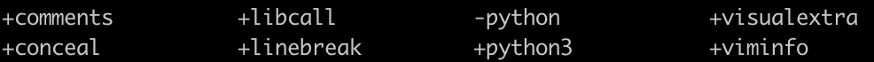
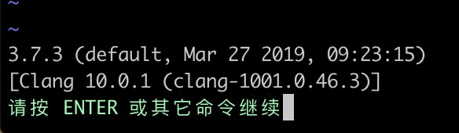

# vim搭建python开发环境

[TOC]

该篇是基于阅读[原文文章](<https://www.cnblogs.com/heqiuyu/articles/5630167.html>)后的个人记录，按照原文操作会存在几处问题，以下记录均已给予解决

## 环境

* 操作系统：mac os 10.14.4
* vim版本：系统自带的8.0、以及个人brew安装的8.1
  * 系统自带8.0版本，默认支持系统自带的python2.7
  * 个人安装的8.1版本，支持个人安装的python3.7
* python版本：系统自动的2.7，以及个人brew安装的3.7


## 安装与环境验证

* 确认vim版本以及是否支持python扩展 

  `vim --version`

  若输出包含+python或+python3，则为支持python，例如本人输出如下，说明支持python3，而不支持系统自带的python：

  

* 在vim中查看python具体版本好，进一步确认vim支持python

  `vim`

  `: python3 import sys; print(sys.version)`

  依次输入以上命令，首先vim进入vim中，然后进入命令模式输入第二条命令，如vim支持python，则会输出对应的版本号，如下：

  

  > **注意**
  >
  > 如果你的vim是+python，-python3情况，且系统安装了2个python版本（例如系统自带的python，和个人安装的python3），那以上第二条命令需要改成python import sys，此处需要进行对应，否则会报错: "E319: 抱歉，命令在此版本中不可用", 并且下文中提到的.vimrc文件的配置中，pip和pip3、python和python3都要进行区分，要明确你的vim支持哪个版本的python，用对版本相应的指令。


## 开发环境搭建

### 安装vundle

vundle是vim用来管理插件的一个工具，安装以后只需要在.vimrc文件中添加插件名称，然后进行vim通过执行命令VundleInstall即可安装插件，需要卸载插件只需要删除配置文件中对应的行，然后执行VundleClean即可。安装vundle命令如下：

`git clone https://github.com/gmarik/Vundle.vim.git ~/.vim/bundle/Vundle.vim`

`touch ~/.vimrc`

将以下内容黏贴进.vimrc文件中

```
set nocompatible              " required
filetype off                  " required

" set the runtime path to include Vundle and initialize
set rtp+=~/.vim/bundle/Vundle.vim
call vundle#begin()

" alternatively, pass a path where Vundle should install plugins
"call vundle#begin('~/some/path/here')

" let Vundle manage Vundle, required
Plugin 'gmarik/Vundle.vim'

" Add all your plugins here (note older versions of Vundle used Bundle instead of Plugin)


" All of your Plugins must be added before the following line
call vundle#end()            " required
filetype plugin indent on    " required
```

###分割布局

有时我们需要在一个页面打开多个窗口页面，方便进行对比与切换编辑等，很多终端支持一个页面打开多个终端窗口，例如mac的iterm2，不过我们也可以通过vim自身的命令来布局多窗口

`:sv <filename>`  纵向分割，在原窗口上方新建vim窗口

`:vs <filename>` 横行分割，在原窗口左方新建vim窗口

打开了多个vim窗口后，窗口之间的切换可以通过将以下内容加入.vimrc内之后，利用ctrl+j/k/h/l进行上下左右切换

```
"split navigations
nnoremap <C-J> <C-W><C-J>
nnoremap <C-K> <C-W><C-K>
nnoremap <C-L> <C-W><C-L>
nnoremap <C-H> <C-W><C-H>
```

> **注意**
>
> 添加以上快捷键进行窗口切换后，有时会导致vim中删除键无效，此时需要添加以下配置即可：
>
> `set backspace=indent,eol,start`

###代码折叠

在.vimrc中如下设置即可：

```
" Enable folding
set foldmethod=indent
set foldlevel=99
" Enable folding with the spacebar
nnoremap <space> za

au BufNewFile,BufRead *.py
\ set tabstop=4 |
\ set softtabstop=4 |
\ set shiftwidth=4 |
\ set textwidth=79 |
\ set expandtab |
\ set autoindent |
\ set fileformat=unix
```

更多折叠功能可以安装如下2个插件体验：

```
Bundle 'tmhedberg/SimpylFold'
Bundle 'vim-scripts/indentpython.vim'
```

### 标示空白字符

在.vimrc中添加如下设置：

> au BufRead,BufNewFile *.py,*.pyw,*.c,*.h match Error /\s\+$/

### 自动补全

推荐使用YouCompleteMe插件进行自动补全，可见官网[详细安装过程](<http://valloric.github.io/YouCompleteMe/#mac-os-x>)

下面主要说明mac的安装过程：

在.vimrc中配置插件，然后执行安装:BundleInstall，该步骤需要耗费一定时间进行安装，耐心等待

```
Bundle 'Valloric/YouCompleteMe'
```

安装完成后，执行以下命令安装必要的基础支持：

```
brew install cmake
cd ~/.vim/bundle/YouCompleteMe
./install.py --clang-completer
./install.py --all
```

至此，vim已经支持python代码自动补全功能，还可以进行一些细微调整：

```
let g:ycm_autoclose_preview_window_after_completion=1
map <leader>g  :YcmCompleter GoToDefinitionElseDeclaration<CR>
```

第一行确保了在你完成操作之后，自动补全窗口不会消失，第二行则定义了**“转到定义”** 的快捷方式

> vim中光标的前进后退快捷键为
>
> ​	ctrl+o：后退
>
> ​	ctrl+i：前进

YCM常用命令

> Tab：向下循环选择函数
>
> shift+tab：向上循环选择函数
>
> ctrl+space: 任何情况下跳出提示，mac默认输入法切换也使用该快捷键，修改/关闭mac该快捷键即可；当然也可以直接在.vimrc文件中修改ycm的快捷键，命令如下：
>
> ```
> let g:ycm_key_invoke_completion = '<C-Space>'
> ```
>
> ### 

### 括号补全

可以使用[aoto-paris](<https://github.com/jiangmiao/auto-pairs>)

```
Bundle 'jiangmiao/auto-pairs'
```

### 函数参数补全

可以使用jedi-vim

```
pip3 install jedi
Bundle 'davidhalter/jedi-vim'
```

### 支持Virtualenv虚拟环境

```
" python with virtualenv support
py3 << EOF
import os
import sys
if 'VIRTUAL_ENV' in os.environ:
  project_base_dir = os.environ['VIRTUAL_ENV']
  activate_this = os.path.join(project_base_dir, 'bin/activate_this.py')
  execfile(activate_this, dict(__file__=activate_this))
EOF
```

> **注意**
>
> vim支持python3时需要输入py3 << EOF, 否则报错，py << EOF是python2的语法

### 语法检查/高亮

通过安装 [syntastic](https://github.com/scrooloose/syntastic) 插件，每次保存文件时Vim都会检查代码的语法：

```
Bundle 'scrooloose/syntastic'
```

还可以通过这个小巧的插件，添加PEP8代码风格检查：

```
Bundle 'nvie/vim-flake8'
```

最后，让你的代码变得更漂亮：

```
let python_highlight_all=1
syntax on
```

### 配色方案

配色方案可以和你正在使用的基础配色共同使用，看个人喜好，也不不设置。GUI模式可以尝试 [solarized方案](https://github.com/altercation/vim-colors-solarized), 终端模式可以尝试 [Zenburn方案](https://github.com/jnurmine/Zenburn) ：

```
Bundle 'jnurmine/Zenburn'
Bundle 'altercation/vim-colors-solarized'
```

接下来，只需要添加一点逻辑判断，确定什么模式下使用何种方案就可以了：

```
if has('gui_running')
  set background=dark
  colorscheme solarized
else
  colorscheme Zenburn
endif
```

Solarized方案同时提供了暗色调和轻色调两种主题。要支持切换主题功能（按F5）也非常简单，只需添加：

```
call togglebg#map("<F5>")
```

### 目录树

如果你想要一个不错的文件树形结构，那么NERDTree是不二之选。

```
Bundle 'scrooloose/nerdtree'
```

如果你想用tab键，可以利用vim-nerdtree-tabs插件实现：

```
Bundle 'jistr/vim-nerdtree-tabs'
```

还想隐藏.pyc文件？那么再添加下面这行代码吧：

```
let NERDTreeIgnore=['\.pyc$', '\~$'] "ignore files in NERDTree
```

安装完成后，可进行如下设置F3为快捷键打开/收起目录树：

```
" 设置NerdTree
map <F3> :NERDTreeMirror<CR>
map <F3> :NERDTreeToggle<CR>
```

常用命令

进入当前目录的树形界面，通过小键盘"上下"键，能移动选中的目录或文件。目录前面有"+"号，按Enter会展开目录，文件前面是"-"号，按Enter会在右侧窗口展现该文件的内容，并光标的焦点focus右侧。"ctr+w+h"光标focus左侧树形目录，"ctrl+w+l"光标focus右侧文件显示窗口。多次按"ctrl+w"，光标自动在左右侧窗口切换。光标focus左侧树形窗口，按"？"弹出NERDTree的帮助，再次按"？"关闭帮助显示。输入":q"回车，关闭光标所在窗口。

NERDTree提供了丰富的键盘操作方式来浏览和打开文件，介绍一些常用的快捷键：

- 和编辑文件一样，通过h j k l移动光标定位
- 打开关闭文件或者目录，如果是文件的话，光标出现在打开的文件中
- go 效果同上，不过光标保持在文件目录里，类似预览文件内容的功能
- i和s可以水平分割或纵向分割窗口打开文件，前面加g类似go的功能
- t 在标签页中打开
- T 在后台标签页中打开
- p 到上层目录
- P 到根目录
- K 到同目录第一个节点
- J 到同目录最后一个节点
- m 显示文件系统菜单（添加、删除、移动操作）
- ? 帮助
- q 关闭

### 超级搜索

想要在Vim中搜索任何文件？试试ctrlP插件吧：

```
Bundle 'kien/ctrlp.vim'
```

正如插件名，按Ctrl+P就可以进行搜索。更多信息，可以观看这个 [YouTube video](http://www.youtube.com/watch?v=9XrHk3xjYsw) .

### git集成

想要在Vim中执行基本的Git命令？vim-fugitive插件则是不二之选。

```
Bundle 'tpope/vim-fugitive'
```

请看Vimcasts的 [这部视频](http://vimcasts.org/episodes/fugitive-vim---a-complement-to-command-line-git/) ，了解更多情况。

### Powerline状态栏

Powerline是一个状态栏插件，可以显示当前的虚拟环境、Git分支、正在编辑的文件等信息。

这个插件是用Python编写的，支持诸如zsh、bash、tmux和IPython等多种环境。

```
Bundle 'Lokaltog/powerline', {'rtp': 'powerline/bindings/vim/'}
```

```
" powerline
set laststatus=2
set guifont=PowerlineSymbols\ for\ Powerline
set nocompatible
set t_Co=256
let g:Powerline_symbols = 'fancy'
```

请查阅插件的[官方文档](<https://github.com/powerline/powerline>)


## vim学习资源

1. [Vim Tutor](http://linuxcommand.org/man_pages/vimtutor1.html) 是Vim自带的程序，安装结束之后，只要在命令行输入 `vimtutor` 即可，程序将会用Vim编辑器教你如何使用Vim。
2. [Vimcasts](http://vimcasts.org/) 是一系列的高阶视频教程，内容涉及许多Vim的功能。
3. [Vim官方文档](http://www.vim.org/docs.php)
4. [Open Vim](http://www.openvim.com/)
5. [笨办法学Vimscript](http://learnvimscriptthehardway.stevelosh.com/) 是学习vimscript的极好材料。